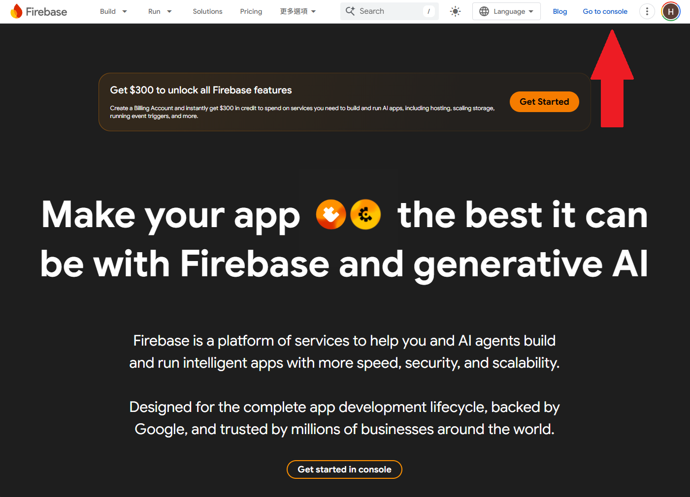
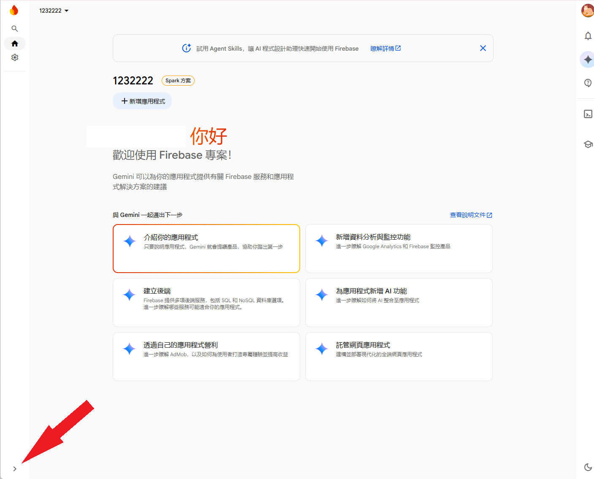
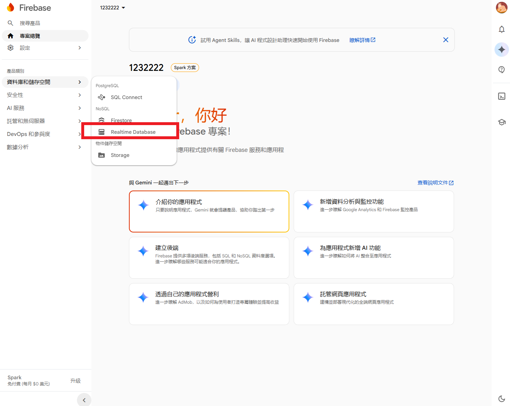
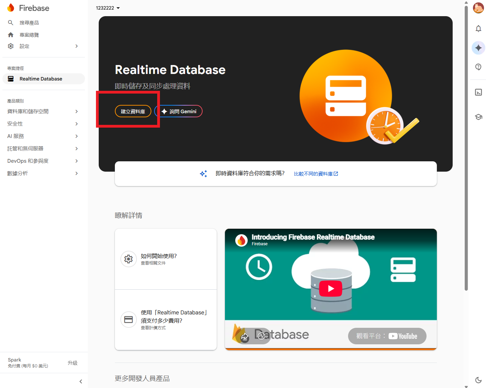
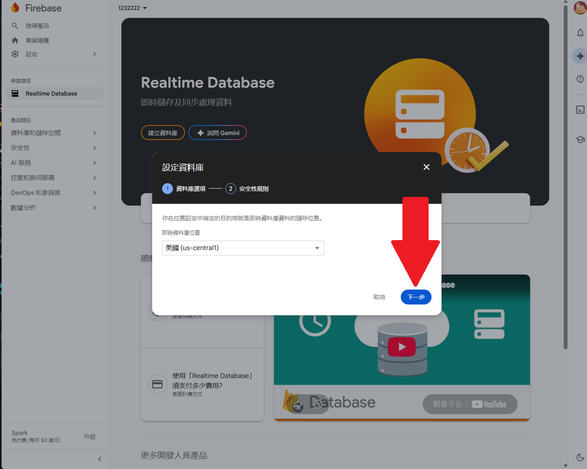
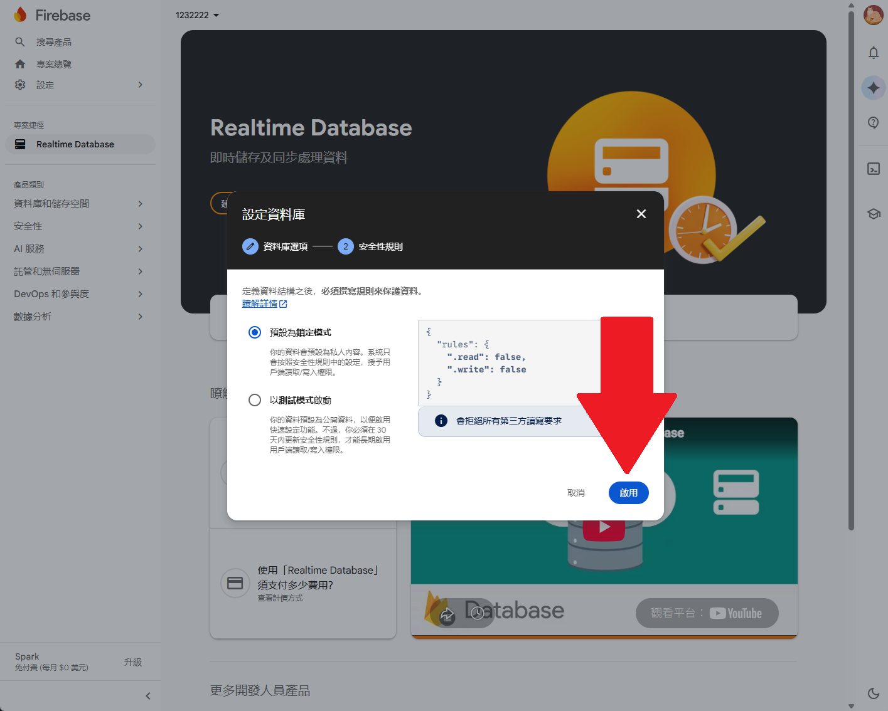
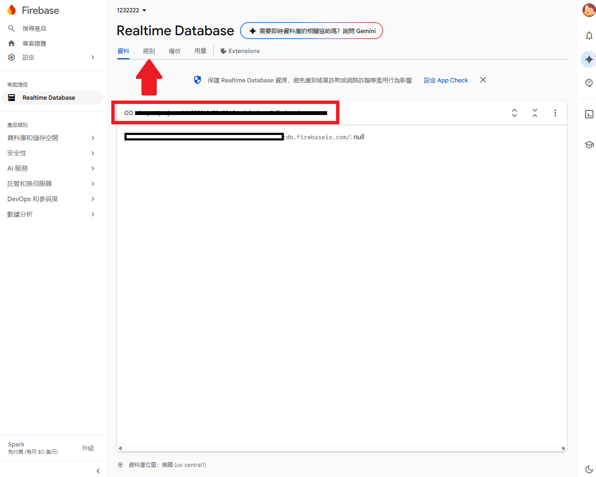
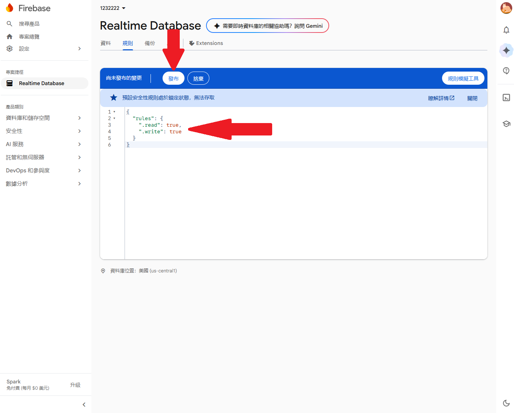
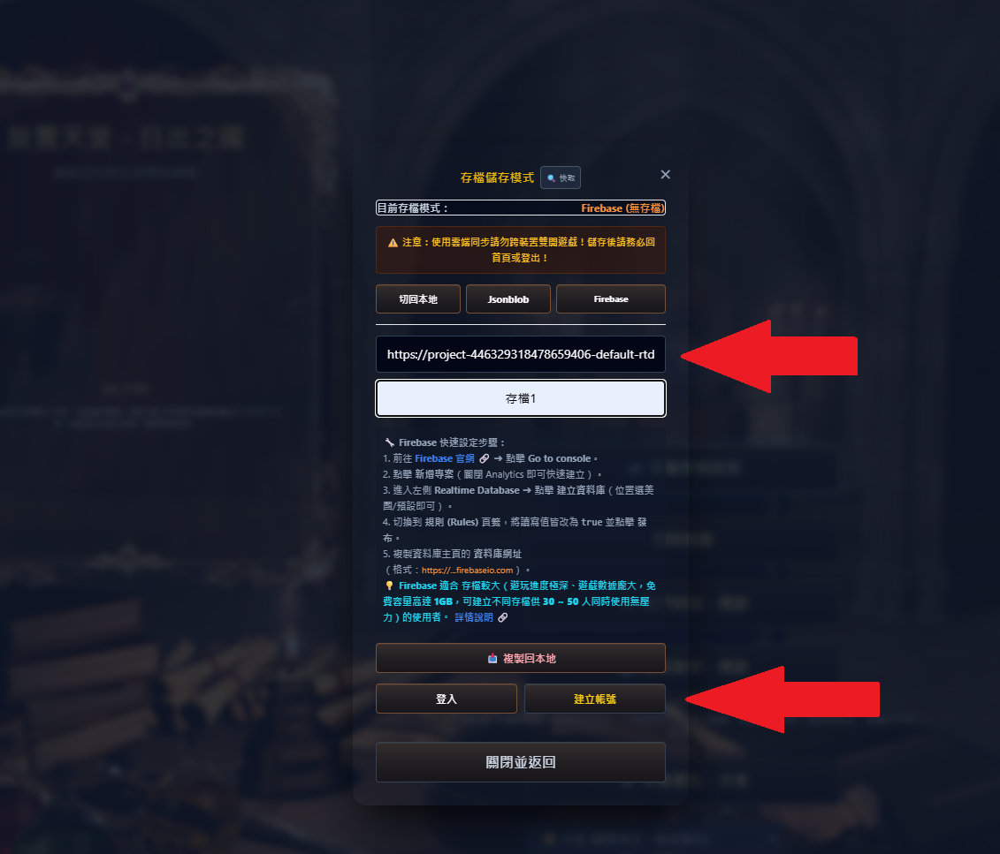

# ☁️ 天堂放置版 - Firebase 雲端存檔同步教學

這是一份透過 **Google Firebase** 來當作遊戲資料同步伺服器的完整使用步驟。
自己建立免費的雲端伺服器非常簡單，而且**只要 1 個人建立，分享給 50 個朋友一起用也完全沒問題！**

## 🛠️ Firebase 申請與設定步驟

請跟著以下 9 個步驟操作（可搭配圖片對照觀看）：

1. **點擊 Go to console** 
   前往 [Firebase 官網](https://firebase.google.com/)，點擊右上角進入控制台（您的 Google 帳號可能需要開通兩步驟驗證）。
   

2. **開啟側邊欄位**
   登入專案後，點擊左下角開啟側邊選單欄位。
   

3. **進入 Realtime Database**
   點擊側邊欄的「資料庫和儲存空間 (Build)」，然後選擇「**Realtime Database**」。
   

4. **建立資料庫**
   點擊畫面上的「建立資料庫」按鈕。
   

5. **選擇伺服器位置**
   位置選擇「美國」(或亞洲地區)，然後按下一步。
   

6. **選擇安全規則**
   選擇「**預設為鎖定模式**」，然後按下「啟用」。
   

7. **取得伺服器網址並前往設定規則**
   等待開通後，畫面上方出現的那串網址就是您的「**Firebase 伺服器網址**」。
   接著點選上方的「**規則 (Rules)**」標籤頁（我們需要設定規則讓遊戲可以讀取和寫入存檔）。
   

8. **開放讀寫權限**
   把規則程式碼裡的 `.read` 與 `.write` 後面的 `false` 都改成 **`true`**，然後按下「發布」。
   

9. **回到遊戲綁定**
   回到遊戲的雲端介面，填上剛剛拿到的 **Firebase 伺服器網址**，按下「建立帳號」，並輸入您想要的帳號名稱，就大功告成了！
   

---

## 💡 關於帳號登入與共用

* **帳號自由設定：** 帳號名稱可以自己隨意設定（例如：您的英文名字或遊戲ID）。
* **跨裝置無縫登入：** 只要填入這組 **Firebase 伺服器網址** 搭配您的 **帳號名稱**，就可以在任何裝置上（手機/另一台電腦）登入並同步進度。
* **與朋友同樂：** 您完全可以大方地將這個網址分享給朋友，幫他建立一個帳號，讓他也能享受雲端存檔的便利！
